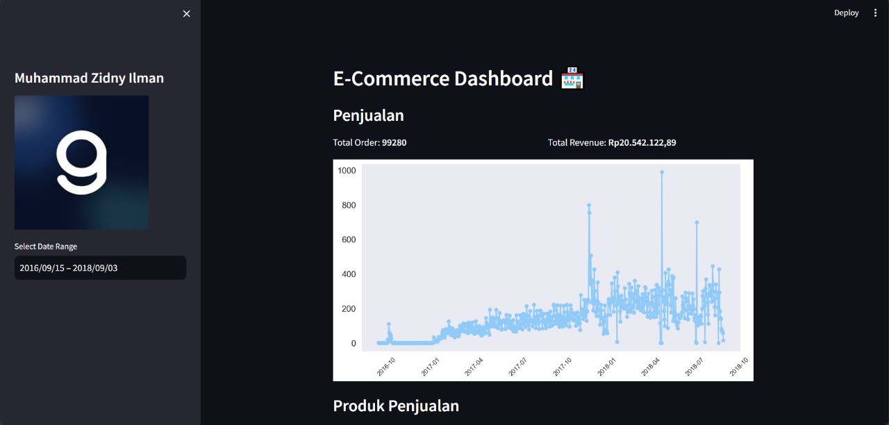
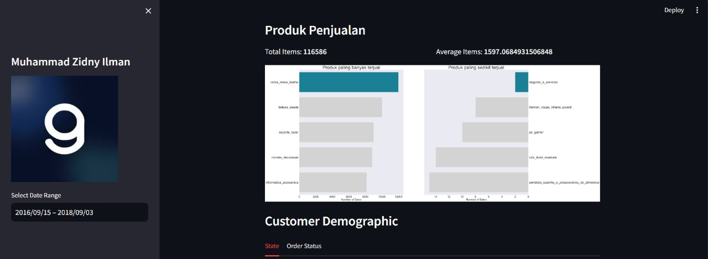
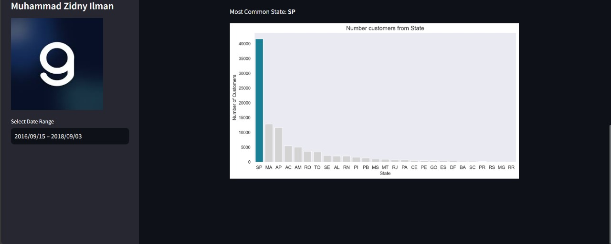

## Submission Belajar Analisis Data Dengan Python : Data Set E-Commerce
</img>
</img>
</img>

## Table of Contents
- [Overview](#overview)
- [Project Structure](#project-structure)
- [Installation](#installation)
- [Usage](#usage)
- [Data Sources](#data-sources)

## Overview
This undertaking involves an in-depth examination and visualization of public e-commerce data, centering on data manipulation, exploratory data analysis (EDA), and the creation of an interactive Streamlit dashboard. The primary goal is to conduct a thorough analysis of the E-Commerce Public Dataset.

## Project Structure
- `dashboard/`: This directory contains dashboard.py which is used to create dashboards of data analysis results.
- `data/`: Directory containing the raw CSV data files.
- `Proyek_Analisis_Data.ipynb`: This file is used to perform data analysis.
- `README.md`: This documentation file.

## Installation
1. Clone this repository to your local machine:
```
git clone https://github.com/zdnyilmn/tugasakhir_dicoding.git
```

or you can visit this website [Project Data Analytics](https://tugasakhirdicoding-5dzv6fkvxw5euoehpxvvy8.streamlit.app/)

2. Go to the project directory
```
cd tugasakhir_dicoding
```
3. Install the required Python packages by running:
```
pip install -r requirements.txt
```

## Usage
1. **Data Wrangling**: Data wrangling scripts are available in the `Proyek_Analaisis_Data.ipynb` file to prepare and clean the data.

2. **Exploratory Data Analysis (EDA)**: Explore and analyze the data using the provided Python scripts. EDA insights can guide your understanding of e-commerce public data patterns.

3. **Visualization**: Run the Streamlit dashboard for interactive data exploration:

```
cd tugasakhir_dicoding/dashboard
streamlit run dashboard.py
```
Access the dashboard in your web browser at `http://localhost:8501`.

## Data Sources
The project uses E-Commerce Public Dataset from [Belajar Analisis Data dengan Python's Final Project](https://drive.google.com/file/d/1MsAjPM7oKtVfJL_wRp1qmCajtSG1mdcK/view) offered by [Dicoding](https://www.dicoding.com/).
